# 🧠 Antigravity Global Skill Registry

> This repository architecture uses a future-proof, infinitely scalable decimal taxonomy.
> Every skill is auto-discovered by Antigravity across all conversations referencing this workspace.

| ID | Category | Sub-Category | Skill Name | Path |
|---|---|---|---|---|
| 1.1.1 | Marketing And Growth | Linkedin Ecosystem | Linkedin Mastery | [Link](./1_marketing_and_growth/1.1_linkedin_ecosystem/1.1.1_linkedin_mastery/SKILL.md) |
| 1.1.2 | Marketing And Growth | Linkedin Ecosystem | Profile Optimizer | [Link](./1_marketing_and_growth/1.1_linkedin_ecosystem/1.1.2_profile_optimizer/SKILL.md) |
| 1.1.3 | Marketing And Growth | Linkedin Ecosystem | Content Creator | [Link](./1_marketing_and_growth/1.1_linkedin_ecosystem/1.1.3_content_creator/SKILL.md) |
| 1.1.4 | Marketing And Growth | Linkedin Ecosystem | Automation Bot | [Link](./1_marketing_and_growth/1.1_linkedin_ecosystem/1.1.4_automation_bot/SKILL.md) |
| 1.1.5 | Marketing And Growth | Linkedin Ecosystem | Linkedin Authority Architect | [Link](./1_marketing_and_growth/1.1_linkedin_ecosystem/1.1.5_linkedin_authority_architect/SKILL.md) |
| 1.2.1 | Marketing And Growth | Search And Seo | Seo Site Architecture | [Link](./1_marketing_and_growth/1.2_search_and_seo/1.2.1_seo_site_architecture/SKILL.md) |
| 1.2.2 | Marketing And Growth | Search And Seo | Omni Seo Dominance | [Link](./1_marketing_and_growth/1.2_search_and_seo/1.2.2_omni_seo_dominance/SKILL.md) |
| 1.3.1 | Marketing And Growth | Copywriting And Cro | Conversion Copywriting | [Link](./1_marketing_and_growth/1.3_copywriting_and_cro/1.3.1_conversion_copywriting/SKILL.md) |
| 1.3.2 | Marketing And Growth | Copywriting And Cro | Cro Optimization | [Link](./1_marketing_and_growth/1.3_copywriting_and_cro/1.3.2_cro_optimization/SKILL.md) |
| 1.4.1 | Marketing And Growth | Campaigns And Sales | Content Product Launches | [Link](./1_marketing_and_growth/1.4_campaigns_and_sales/1.4.1_content_product_launches/SKILL.md) |
| 1.4.2 | Marketing And Growth | Campaigns And Sales | Sales Cold Outreach | [Link](./1_marketing_and_growth/1.4_campaigns_and_sales/1.4.2_sales_cold_outreach/SKILL.md) |
| 1.4.3 | Marketing And Growth | Campaigns And Sales | Performance Marketing Ops | [Link](./1_marketing_and_growth/1.4_campaigns_and_sales/1.4.3_performance_marketing_ops/SKILL.md) |
| 1.5.1 | Marketing And Growth | Strategy And Retention | Growth And Strategy | [Link](./1_marketing_and_growth/1.5_strategy_and_retention/1.5.1_growth_and_strategy/SKILL.md) |
| 1.5.2 | Marketing And Growth | Strategy And Retention | Retention Referral | [Link](./1_marketing_and_growth/1.5_strategy_and_retention/1.5.2_retention_referral/SKILL.md) |
| 1.5.3 | Marketing And Growth | Strategy And Retention | Growth Engineering | [Link](./1_marketing_and_growth/1.5_strategy_and_retention/1.5.3_growth_engineering/SKILL.md) |
| 2.1.1 | Engineering And Devops | Architecture And Design | End To End App Development | [Link](./2_engineering_and_devops/2.1_architecture_and_design/2.1.1_end_to_end_app_development/SKILL.md) |
| 2.1.2 | Engineering And Devops | Architecture And Design | Project Scaffolding | [Link](./2_engineering_and_devops/2.1_architecture_and_design/2.1.2_project_scaffolding/SKILL.md) |
| 2.1.3 | Engineering And Devops | Architecture And Design | Web Dev Design Systems | [Link](./2_engineering_and_devops/2.1_architecture_and_design/2.1.3_web_dev_design_systems/SKILL.md) |
| 2.1.4 | Engineering And Devops | Architecture And Design | Web Design Guidelines | [Link](./2_engineering_and_devops/2.1_architecture_and_design/2.1.4_web_design_guidelines/SKILL.md) |
| 2.2.1 | Engineering And Devops | Frontend Applications | Vercel React Best Practices | [Link](./2_engineering_and_devops/2.2_frontend_applications/2.2.1_vercel_react_best_practices/SKILL.md) |
| 2.2.2 | Engineering And Devops | Frontend Applications | Pwa Offline First | [Link](./2_engineering_and_devops/2.2_frontend_applications/2.2.2_pwa_offline_first/SKILL.md) |
| 2.2.3 | Engineering And Devops | Frontend Applications | App Arbitrage | [Link](./2_engineering_and_devops/2.2_frontend_applications/2.2.3_app_arbitrage/SKILL.md) |
| 2.2.4 | Engineering And Devops | Frontend Applications | India First Localization | [Link](./2_engineering_and_devops/2.2_frontend_applications/2.2.4_india_first_localization/SKILL.md) |
| 2.3.1 | Engineering And Devops | Backend And Cloud | Firebase Baas | [Link](./2_engineering_and_devops/2.3_backend_and_cloud/2.3.1_firebase_baas/SKILL.md) |
| 2.3.2 | Engineering And Devops | Backend And Cloud | Supabase Skills | [Link](./2_engineering_and_devops/2.3_backend_and_cloud/2.3.2_supabase_skills/SKILL.md) |
| 2.4.1 | Engineering And Devops | Deployment And Devops | Cicd Git Deployment | [Link](./2_engineering_and_devops/2.4_deployment_and_devops/2.4.1_cicd_git_deployment/SKILL.md) |
| 2.4.2 | Engineering And Devops | Deployment And Devops | Secure App Deployment | [Link](./2_engineering_and_devops/2.4_deployment_and_devops/2.4.2_secure_app_deployment/SKILL.md) |
| 2.4.3 | Engineering And Devops | Deployment And Devops | Git Commit Formatter | [Link](./2_engineering_and_devops/2.4_deployment_and_devops/2.4.3_git_commit_formatter/SKILL.md) |
| 2.5.1 | Engineering And Devops | Security And Testing | Trail Of Bits Security | [Link](./2_engineering_and_devops/2.5_security_and_testing/2.5.1_trail_of_bits_security/SKILL.md) |
| 2.5.2 | Engineering And Devops | Security And Testing | Webapp Testing Playwright | [Link](./2_engineering_and_devops/2.5_security_and_testing/2.5.2_webapp_testing_playwright/SKILL.md) |
| 2.5.3 | Engineering And Devops | Security And Testing | Dify Frontend Tester | [Link](./2_engineering_and_devops/2.5_security_and_testing/2.5.3_dify_frontend_tester/SKILL.md) |
| 2.6.1 | Engineering And Devops | Desktop And Native | Electron Upgrade Advisor | [Link](./2_engineering_and_devops/2.6_desktop_and_native/2.6.1_electron_upgrade_advisor/SKILL.md) |
| 3.1.1 | Ai And Agents | Agent Orchestration | Ai Dev Workflows | [Link](./3_ai_and_agents/3.1_agent_orchestration/3.1.1_ai_dev_workflows/SKILL.md) |
| 3.1.2 | Ai And Agents | Agent Orchestration | Antigravity Superpowers | [Link](./3_ai_and_agents/3.1_agent_orchestration/3.1.2_antigravity_superpowers/SKILL.md) |
| 3.1.99 | Ai And Agents | Agent Orchestration | Legacy Antigravity Skills | [Link](./3_ai_and_agents/3.1_agent_orchestration/3.1.99_legacy_antigravity_skills/SKILL.md) |
| 3.2.1 | Ai And Agents | Agent Tooling | Mcp Server Builder | [Link](./3_ai_and_agents/3.2_agent_tooling/3.2.1_mcp_server_builder/SKILL.md) |
| 3.2.2 | Ai And Agents | Agent Tooling | Connect Automation | [Link](./3_ai_and_agents/3.2_agent_tooling/3.2.2_connect_automation/SKILL.md) |
| 3.3.1 | Ai And Agents | Skill Management | Prompt Lookup | [Link](./3_ai_and_agents/3.3_skill_management/3.3.1_prompt_lookup/SKILL.md) |
| 3.3.2 | Ai And Agents | Skill Management | Skill Installer | [Link](./3_ai_and_agents/3.3_skill_management/3.3.2_skill_installer/SKILL.md) |
| 4.1.1 | Business And Operations | Document Generation | Document Skills | [Link](./4_business_and_operations/4.1_document_generation/4.1.1_document_skills/SKILL.md) |
| 4.2.1 | Business And Operations | Media Creation | Remotion Video Editor | [Link](./4_business_and_operations/4.2_media_creation/4.2.1_remotion_video_editor/SKILL.md) |
| 9.1.1 | Mega Bundles | Ai Agent Bundle | Ai Agent Bundle | [Link](./9_mega_bundles/9.1_ai_agent_bundle/9.1.1_ai_agent_bundle/SKILL.md) |
| 9.2.1 | Mega Bundles | Web Frontend Bundle | Web Frontend Bundle | [Link](./9_mega_bundles/9.2_web_frontend_bundle/9.2.1_web_frontend_bundle/SKILL.md) |
| 9.3.1 | Mega Bundles | Backend Api Bundle | Backend Api Bundle | [Link](./9_mega_bundles/9.3_backend_api_bundle/9.3.1_backend_api_bundle/SKILL.md) |
| 9.4.1 | Mega Bundles | Devops Cloud Bundle | Devops Cloud Bundle | [Link](./9_mega_bundles/9.4_devops_cloud_bundle/9.4.1_devops_cloud_bundle/SKILL.md) |
| 9.5.1 | Mega Bundles | Automation Lowcode Bundle | Automation Lowcode Bundle | [Link](./9_mega_bundles/9.5_automation_lowcode_bundle/9.5.1_automation_lowcode_bundle/SKILL.md) |
| 9.6.1 | Mega Bundles | Data Science Bundle | Data Science Bundle | [Link](./9_mega_bundles/9.6_data_science_bundle/9.6.1_data_science_bundle/SKILL.md) |
| 9.7.1 | Mega Bundles | Security Pentesting Bundle | Security Pentesting Bundle | [Link](./9_mega_bundles/9.7_security_pentesting_bundle/9.7.1_security_pentesting_bundle/SKILL.md) |
| 9.8.1 | Mega Bundles | Marketing Growth Bundle | Marketing Growth Bundle | [Link](./9_mega_bundles/9.8_marketing_growth_bundle/9.8.1_marketing_growth_bundle/SKILL.md) |
| 9.9.1 | Mega Bundles | Mobile Native Bundle | Mobile Native Bundle | [Link](./9_mega_bundles/9.9_mobile_native_bundle/9.9.1_mobile_native_bundle/SKILL.md) |
| 9.10.1 | Mega Bundles | Business Productivity Bundle | Business Productivity Bundle | [Link](./9_mega_bundles/9.10_business_productivity_bundle/9.10.1_business_productivity_bundle/SKILL.md) |

## Skill Logical Architecture

```mermaid
graph TD
    %% Top Level Domains
    TL1[Marketing & Growth]
    TL2[Engineering & DevOps]
    TL3[AI & Agent Orchestration]
    TL4[Business & Operations]

    TL1 --> SUB_1_1[Linkedin Ecosystem]
    SUB_1_1 --> S_1_1_1[Linkedin Mastery]
    SUB_1_1 --> S_1_1_2[Profile Optimizer]
    SUB_1_1 --> S_1_1_3[Content Creator]
    SUB_1_1 --> S_1_1_4[Automation Bot]
    SUB_1_1 --> S_1_1_5[Linkedin Authority Architect]
    TL1 --> SUB_1_2[Search And Seo]
    SUB_1_2 --> S_1_2_1[Seo Site Architecture]
    SUB_1_2 --> S_1_2_2[Omni Seo Dominance]
    TL1 --> SUB_1_3[Copywriting And Cro]
    SUB_1_3 --> S_1_3_1[Conversion Copywriting]
    SUB_1_3 --> S_1_3_2[Cro Optimization]
    TL1 --> SUB_1_4[Campaigns And Sales]
    SUB_1_4 --> S_1_4_1[Content Product Launches]
    SUB_1_4 --> S_1_4_2[Sales Cold Outreach]
    SUB_1_4 --> S_1_4_3[Performance Marketing Ops]
    TL1 --> SUB_1_5[Strategy And Retention]
    SUB_1_5 --> S_1_5_1[Growth And Strategy]
    SUB_1_5 --> S_1_5_2[Retention Referral]
    SUB_1_5 --> S_1_5_3[Growth Engineering]
    TL2 --> SUB_2_1[Architecture And Design]
    SUB_2_1 --> S_2_1_1[End To End App Development]
    SUB_2_1 --> S_2_1_2[Project Scaffolding]
    SUB_2_1 --> S_2_1_3[Web Dev Design Systems]
    SUB_2_1 --> S_2_1_4[Web Design Guidelines]
    TL2 --> SUB_2_2[Frontend Applications]
    SUB_2_2 --> S_2_2_1[Vercel React Best Practices]
    SUB_2_2 --> S_2_2_2[Pwa Offline First]
    SUB_2_2 --> S_2_2_3[App Arbitrage]
    SUB_2_2 --> S_2_2_4[India First Localization]
    TL2 --> SUB_2_3[Backend And Cloud]
    SUB_2_3 --> S_2_3_1[Firebase Baas]
    SUB_2_3 --> S_2_3_2[Supabase Skills]
    TL2 --> SUB_2_4[Deployment And Devops]
    SUB_2_4 --> S_2_4_1[Cicd Git Deployment]
    SUB_2_4 --> S_2_4_2[Secure App Deployment]
    SUB_2_4 --> S_2_4_3[Git Commit Formatter]
    TL2 --> SUB_2_5[Security And Testing]
    SUB_2_5 --> S_2_5_1[Trail Of Bits Security]
    SUB_2_5 --> S_2_5_2[Webapp Testing Playwright]
    SUB_2_5 --> S_2_5_3[Dify Frontend Tester]
    TL2 --> SUB_2_6[Desktop And Native]
    SUB_2_6 --> S_2_6_1[Electron Upgrade Advisor]
    TL3 --> SUB_3_1[Agent Orchestration]
    SUB_3_1 --> S_3_1_1[Ai Dev Workflows]
    SUB_3_1 --> S_3_1_2[Antigravity Superpowers]
    SUB_3_1 --> S_3_1_99[Legacy Antigravity Skills]
    TL3 --> SUB_3_2[Agent Tooling]
    SUB_3_2 --> S_3_2_1[Mcp Server Builder]
    SUB_3_2 --> S_3_2_2[Connect Automation]
    TL3 --> SUB_3_3[Skill Management]
    SUB_3_3 --> S_3_3_1[Prompt Lookup]
    SUB_3_3 --> S_3_3_2[Skill Installer]
    TL4 --> SUB_4_1[Document Generation]
    SUB_4_1 --> S_4_1_1[Document Skills]
    TL4 --> SUB_4_2[Media Creation]
    SUB_4_2 --> S_4_2_1[Remotion Video Editor]
```

## How the System Works

1. **Antigravity auto-discovers** all skills dynamically based on folder structure.
2. **Reference by decimal ID** in conversations: *"Apply Strategy 1.1.1 to my LinkedIn post."*
3. **To add a new skill**, find the appropriate Sub-Category, increment the highest decimal, and create the folder. Example: Adding `2.2.5_new_react_skill` under `2.2_frontend_applications`.
