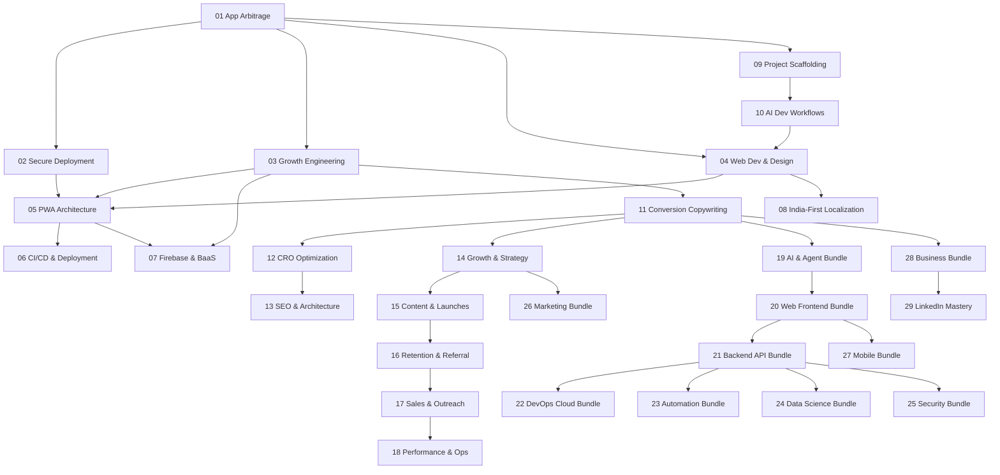

# 🧠 Antigravity Global Skill Registry

> Centralized knowledge base for all projects in the **Business Idea Prototypes** workspace.
> Every skill is auto-discovered by Antigravity across all conversations referencing this workspace.

| ID | Skill | Domain | Version |
|----|-------|--------|---------|
| 01 | [App Arbitrage Blueprint](./01_app_arbitrage/SKILL.md) | Strategy & Monetization | 1.0.0 |
| 02 | [Secure Mass-Market App Deployment](./02_secure_app_deployment/SKILL.md) | Security & Compliance | 1.0.0 |
| 03 | [Growth Engineering & Technical Marketing](./03_growth_engineering/SKILL.md) | Growth & ASO/SEO | 1.0.0 |
| 04 | [Web Development & Design Systems](./04_web_dev_design_systems/SKILL.md) | UI/UX & Frontend | 1.0.0 |
| 05 | [PWA Architecture & Offline-First](./05_pwa_offline_first/SKILL.md) | PWA & Caching | 1.0.0 |
| 06 | [CI/CD, Git & Deployment Pipelines](./06_cicd_git_deployment/SKILL.md) | DevOps & Deployment | 1.0.0 |
| 07 | [Firebase & BaaS Infrastructure](./07_firebase_baas/SKILL.md) | Backend & Cloud | 1.0.0 |
| 08 | [India-First Localization & Regional UX](./08_india_first_localization/SKILL.md) | Localization & Market | 1.0.0 |
| 09 | [Project Scaffolding & Monorepo Management](./09_project_scaffolding/SKILL.md) | Architecture & Tooling | 1.0.0 |
| 10 | [AI-Assisted Development Workflows](./10_ai_dev_workflows/SKILL.md) | AI & Automation | 1.0.0 |
| 11 | [Conversion Copywriting](./11_conversion_copywriting/SKILL.md) | Marketing & Copy | 1.0.0 |
| 12 | [CRO Optimization](./12_cro_optimization/SKILL.md) | Marketing & CRO | 1.0.0 |
| 13 | [SEO & Site Architecture](./13_seo_site_architecture/SKILL.md) | Tech Marketing & SEO | 1.0.0 |
| 14 | [Growth & Strategy](./14_growth_and_strategy/SKILL.md) | Marketing & Strategy | 1.0.0 |
| 15 | [Content & Product Launches](./15_content_product_launches/SKILL.md) | Marketing & Content | 1.0.0 |
| 16 | [Retention & Referral Programs](./16_retention_referral/SKILL.md) | Marketing & Retention | 1.0.0 |
| 17 | [Sales & Cold Outreach](./17_sales_cold_outreach/SKILL.md) | Marketing & B2B Sales | 1.0.0 |
| 18 | [Performance Marketing & Ops](./18_performance_marketing_ops/SKILL.md) | Ads & RevOps | 1.0.0 |
| 19 | [AI & Agent Orchestration](./19_ai_agent_bundle/SKILL.md) | AI & Agents | 1.0.0 |
| 20 | [Web & Frontend Mastery](./20_web_frontend_bundle/SKILL.md) | Web | 1.0.0 |
| 21 | [Backend & API Security](./21_backend_api_bundle/SKILL.md) | Backend & Security | 1.0.0 |
| 22 | [DevOps & Cloud Architecture](./22_devops_cloud_bundle/SKILL.md) | Cloud & DevOps | 1.0.0 |
| 23 | [Automation & Low-Code](./23_automation_lowcode_bundle/SKILL.md) | Automation | 1.0.0 |
| 24 | [Data Science & Analytics](./24_data_science_bundle/SKILL.md) | Data | 1.0.0 |
| 25 | [Security & Pentesting](./25_security_pentesting_bundle/SKILL.md) | Security | 1.0.0 |
| 26 | [Marketing & Growth Mastery](./26_marketing_growth_bundle/SKILL.md) | Marketing | 1.0.0 |
| 27 | [Mobile & Cross-Platform](./27_mobile_native_bundle/SKILL.md) | Mobile | 1.0.0 |
| 28 | [Business & Productivity](./28_business_productivity_bundle/SKILL.md) | Business | 1.0.0 |
| 29 | [LinkedIn Mastery](./29_linkedin_mastery/SKILL.md) | Business & Branding | 1.0.0 |

## Skill Dependencies



## How to Use

1. **Antigravity auto-discovers** all skills in `.agent/skills/` — no manual loading needed.
2. **Reference by ID** in conversations: *"Apply Skill 04 design token standards to this component."*
3. **Cross-reference** between skills: Skill files reference each other by ID number for related guidance.
4. **Add new skills** by creating `NN_skill_name/SKILL.md` with proper YAML frontmatter (see Skill 10 §1 for authoring standards).

## Adding a New Skill

```bash
# 1. Create the skill directory
mkdir -p .agent/skills/11_new_skill_name

# 2. Create SKILL.md with required frontmatter
cat > .agent/skills/11_new_skill_name/SKILL.md << 'EOF'
---
name: 11 New Skill Name
description: Brief description of this skill's domain.
version: 1.0.0
---

# 11 New Skill Name

...
EOF

# 3. Update this registry table
# 4. Commit: git commit -am "feat: add skill 11 — New Skill Name"
```
