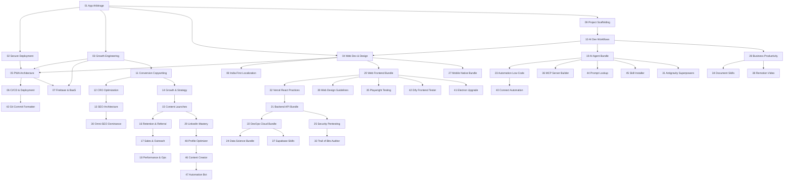

# 🧠 Antigravity Global Skill Registry

> Centralized knowledge base for all projects in the **current** workspace.
> Every skill is auto-discovered by Antigravity across all conversations referencing this workspace.

| ID | Skill | Domain | Version |
|----|-------|--------|---------|
| 01 | [01 App Arbitrage Blueprint](./01_app_arbitrage/SKILL.md) | Various | 1.0.0 |
| 02 | [02 Secure Mass-Market App Deployment](./02_secure_app_deployment/SKILL.md) | Various | 1.0.0 |
| 03 | [03 Growth Engineering & Technical Marketing](./03_growth_engineering/SKILL.md) | Various | 1.0.0 |
| 04 | [04 Web Development & Design Systems](./04_web_dev_design_systems/SKILL.md) | Various | 1.0.0 |
| 05 | [05 PWA Architecture & Offline-First](./05_pwa_offline_first/SKILL.md) | Various | 1.0.0 |
| 06 | [06 CI/CD, Git & Deployment Pipelines](./06_cicd_git_deployment/SKILL.md) | Various | 1.0.0 |
| 07 | [07 Firebase & BaaS Infrastructure](./07_firebase_baas/SKILL.md) | Various | 1.0.0 |
| 08 | [08 India-First Localization & Regional UX](./08_india_first_localization/SKILL.md) | Various | 1.0.0 |
| 09 | [09 Project Scaffolding & Monorepo Management](./09_project_scaffolding/SKILL.md) | Various | 1.0.0 |
| 10 | [10 AI-Assisted Development Workflows](./10_ai_dev_workflows/SKILL.md) | Various | 1.0.0 |
| 11 | [11 Conversion Copywriting](./11_conversion_copywriting/SKILL.md) | Various | 1.0.0 |
| 12 | [12 CRO Optimization](./12_cro_optimization/SKILL.md) | Various | 1.0.0 |
| 13 | [13 SEO & Site Architecture](./13_seo_site_architecture/SKILL.md) | Various | 1.0.0 |
| 14 | [14 Growth & Strategy](./14_growth_and_strategy/SKILL.md) | Various | 1.0.0 |
| 15 | [15 Content & Product Launches](./15_content_product_launches/SKILL.md) | Various | 1.0.0 |
| 16 | [16 Retention & Referral Programs](./16_retention_referral/SKILL.md) | Various | 1.0.0 |
| 17 | [17 Sales & Cold Outreach](./17_sales_cold_outreach/SKILL.md) | Various | 1.0.0 |
| 18 | [18 Performance Marketing & Ops](./18_performance_marketing_ops/SKILL.md) | Various | 1.0.0 |
| 19 | [19 AI & Agent Orchestration](./19_ai_agent_bundle/SKILL.md) | Various | 1.0.0 |
| 20 | [20 Web & Frontend Mastery](./20_web_frontend_bundle/SKILL.md) | Various | 1.0.0 |
| 21 | [21 Backend & API Security](./21_backend_api_bundle/SKILL.md) | Various | 1.0.0 |
| 22 | [22 DevOps & Cloud Architecture](./22_devops_cloud_bundle/SKILL.md) | Various | 1.0.0 |
| 23 | [23 Automation & Low-Code](./23_automation_lowcode_bundle/SKILL.md) | Various | 1.0.0 |
| 24 | [24 Data Science & Analytics](./24_data_science_bundle/SKILL.md) | Various | 1.0.0 |
| 25 | [25 Security & Pentesting](./25_security_pentesting_bundle/SKILL.md) | Various | 1.0.0 |
| 26 | [26 Marketing & Growth Mastery](./26_marketing_growth_bundle/SKILL.md) | Various | 1.0.0 |
| 27 | [27 Mobile & Cross-Platform](./27_mobile_native_bundle/SKILL.md) | Various | 1.0.0 |
| 28 | [28 Business & Productivity](./28_business_productivity_bundle/SKILL.md) | Various | 1.0.0 |
| 29 | [29 LinkedIn Mastery](./29_linkedin_mastery/SKILL.md) | Various | 1.0.0 |
| 30 | [30 Search & AI Optimization (Omni-SEO)](./30_omni_seo_dominance/SKILL.md) | Various | 1.0.0 |
| 31 | [31 Antigravity Superpowers](./31_antigravity_superpowers/SKILL.md) | Various | 1.0.0 |
| 32 | [32 Vercel React Best Practices](./32_vercel_react_best_practices/SKILL.md) | Various | 1.0.0 |
| 33 | [33 Trail of Bits Security Auditor](./33_trail_of_bits_security/SKILL.md) | Various | 1.0.0 |
| 34 | [34 Document Skills (PDF/DOCX/PPTX)](./34_document_skills/SKILL.md) | Various | 1.0.0 |
| 35 | [35 Webapp Testing (Playwright)](./35_webapp_testing_playwright/SKILL.md) | Various | 1.0.0 |
| 36 | [36 MCP Server Builder](./36_mcp_server_builder/SKILL.md) | Various | 1.0.0 |
| 37 | [37 Supabase Skills](./37_supabase_skills/SKILL.md) | Various | 1.0.0 |
| 38 | [38 Remotion Video Editor](./38_remotion_video_editor/SKILL.md) | Various | 1.0.0 |
| 39 | [39 Web Design Guidelines](./39_web_design_guidelines/SKILL.md) | Various | 1.0.0 |
| 40 | [40 Connect (Cross-Service Automation)](./40_connect_automation/SKILL.md) | Various | 1.0.0 |
| 41 | [41 Electron Upgrade Advisor](./41_electron_upgrade_advisor/SKILL.md) | Various | 1.0.0 |
| 42 | [42 Dify Frontend Tester](./42_dify_frontend_tester/SKILL.md) | Various | 1.0.0 |
| 43 | [43 Git Commit Formatter](./43_git_commit_formatter/SKILL.md) | Various | 1.0.0 |
| 44 | [44 Prompt Lookup](./44_prompt_lookup/SKILL.md) | Various | 1.0.0 |
| 45 | [45 Skill Installer](./45_skill_installer/SKILL.md) | Various | 1.0.0 |
| 46 | [46 LinkedIn Content Creator](./46_linkedin_content_creator/SKILL.md) | Various | 1.0.0 |
| 47 | [47 LinkedIn Automation Bot](./47_linkedin_automation_bot/SKILL.md) | Various | 1.0.0 |
| 48 | [48 LinkedIn Profile Optimizer](./48_linkedin_profile_optimizer/SKILL.md) | Various | 1.0.0 |

## Skill Dependencies



## How to Use

1. **Antigravity auto-discovers** all skills in `.agent/skills/` — no manual loading needed.
2. **Reference by ID** in conversations: *"Apply Skill 04 design token standards to this component."*
3. **Cross-reference** between skills: Skill files reference each other by ID number for related guidance.
4. **Add new skills** by creating `NN_skill_name/SKILL.md` with proper YAML frontmatter (see Skill 10 §1 for authoring standards).

## Adding a New Skill

```bash
# 1. Create the skill directory
mkdir -p .agent/skills/11_new_skill_name

# 2. Create SKILL.md with required frontmatter
cat > .agent/skills/11_new_skill_name/SKILL.md << 'EOF'
---
name: 11 New Skill Name
description: Brief description of this skill's domain.
version: 1.0.0
---

# 11 New Skill Name

...
EOF

# 3. Update this registry table
# 4. Commit: git commit -am "feat: add skill 11 — New Skill Name"
```
